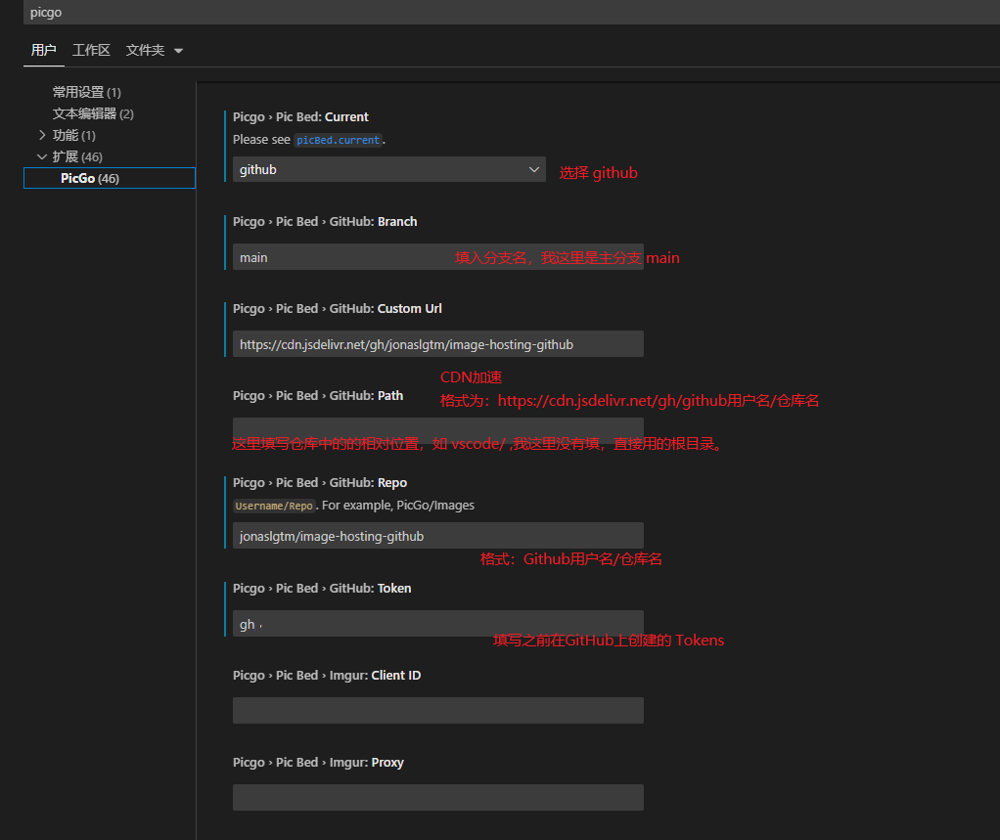

# PicGo + GitHub 搭建个人免费图床

::: tip INFO

搭建个人免费图床实操记录。

:::

## 一、注册 GitHub

略。

## 二、创建 GitHub Public 仓库

**Repository name**：Cloud-Image-Hosting


> <font color="#FF4500">tip:</font> 点击图片可放大查看！

## 三、创建 Tokens

生成一个token用于PicGo操作你的仓库。访问：<https://github.com/settings/tokens>


**第一次访问可能需要验证密码：**

略。

**信息填写：**

- Note: 标记作用，可自定义。
- Expiration: Token 过期时间，懒人就选择 No expiration。在意安全性，按需选择即可。
- Select scopes: 选择仓库操作权限，这里选择 repo。


拖到最下面，点击 Generate token。


**请记住你的 token，这很重要。**

## 四、下载 PicGo

访问：[PicGo](https://github.com/Molunerfinn/picgo/releases)，下载最新版本。

## 五、配置 PicGo

图床设置 ->  GitHub


具体图床参数配置：


- **图床配置名**：当前图床名称，可自定义。

- **设定仓库名**：格式：<font color="#FF6347">用户名/仓库名</font>（可以通过GitHub上创建仓库页的域名快速得到）


- **设定分支名**：默认情况下均为 main 分支

- **设定 Token**：在 GitHub 上创建的 Token。

- **设定存储路径**：可选。存放至 Github 指定仓库的哪个文件夹下。

  - 如果直接放到仓库的根目录下就不需要填写这一栏。
  - 如果需要放到某个目录下，格式：/
  - 当填写的目录不存在时，Github会自动创建对应目录

- **设定自定义域名**：可选。

  - 这里使用免费的CDN：[jsDelivr](https://www.jsdelivr.com/)

```javascript
https://cdn.jsdelivr.net/gh/：固定的前缀，相当于替换掉了Github地址中的 https://github.com/
user：Github上的用户名
repo：仓库名
@version：版本号（这里我们可以不管）
file：文件名（这里我们也不需要加上，因为上传完图片后，它会自动将上传的图片的名字作为存储的文件名）
例如我这里的填写
https://cdn.jsdelivr.net/gh/jonaslgtm/image-hosting-github@latest/xxxx.png
```


**<font color="#b8272c">这里值得注意的是</font>**：如果需要指定上传到哪个分支，此时需要在自定义域名后面使用@ + 分支名，如果是仓库默认的分支，可以省略指定分支这一步。
## 六、 VSCode PicGo 插件配置

**VSCode设置:**

Ctrl + Shift + P 打开配置面板， 搜索 picgo，找到对应的 github 配置项，按照下图进行配置即可。



**上传快捷键：**

从剪贴板上传图像：**Ctrl + Alt + U**

从资源管理器上传图像：**Ctrl + Alt + E**

从输入框上传图片：**Ctrl + Alt + O**

## 测试

测试上传图片，上传成功后，会自动生成一个随机的图片名，并自动将图片上传到GitHub仓库。
